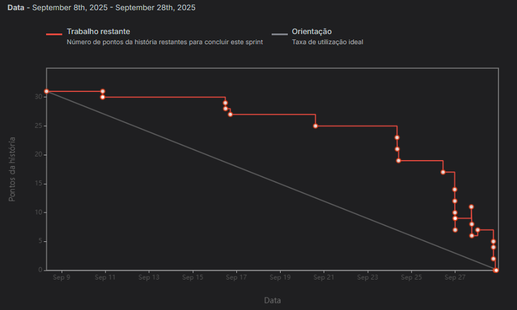

 

    <a href="#objetivos"> Objetivos da Sprint </a> &nbsp |&nbsp &nbsp
    <a href="#entregas"> Entregas </a> &nbsp |&nbsp &nbsp
    <a href="#metricas"> Métricas do Time </a>  &nbsp |&nbsp &nbsp  
    <a href="#backlog"> Backlog da Sprint </a>  &nbsp |&nbsp &nbsp  
    <a href="#links"> Links úteis </a>

No início do desenvolvimento da aplicação de controle de ponto eletrônico, a primeira sprint focou no MVP (Produto Mínimo Viável), priorizando as funcionalidades mais essenciais. A equipe concentrou seus esforços no CRUD básico do sistema. Entre as funcionalidades desenvolvidas, destacam-se o cadastro de estações, parâmetros, alertas e usuários, bem como o sistema de login da plataforma.

# 🎯 Objetivos da Sprint
O principal objetivo nessa sprint a ser comprido era **proporcionar a recepção de dados à partir de uma conexão mqtt**. E de forma adicional também desenvolvemos a **Dashboard da aplicação.**

Os requisitos funcionais atendidos nesta sprint foram:

- ✔️ **RFN02. Coleta de dados meteorológicos:**   A aplicação deve ter a capacidade de coletar e armazenar os dados enviados pelas estações meteorológicas, a partir de diferentes sensores (dinâmico), de forma segura e persistente bem como interpretar tais dados;    
- ✔️ **RFN03. Dashboards:**   A aplicação deve conter uma dashboard que apresenta de forma gráfica os parâmetros das estações, individualmente e de forma geral;    

  

# 📲 Entregas
Durante esta sprint, o time entregou artefatos SCRUM validados, como o Backlog do Produto, o Backlog das Sprints e as User Stories, com a participação direta do P.O. e comunicação constante com o cliente. Para entender e alinhar as expectativas do cliente. Dito isso, juntamente ao cliente, acordamos entregar as seguintes funcionalidades:

### RF 02: Coleta de dados meteorológicos:
A aplicação deve ter a capacidade de coletar e armazenar os dados enviados pelas estações meteorológicas, a partir de diferentes sensores (dinâmico), de forma segura e persistente bem como interpretar tais dados;

### RF 03: Dashboards:
A aplicação deve conter uma dashboard que apresenta de forma gráfica os parâmetros das estações, individualmente e de forma geral;

 

# 📈 Métricas do Time
A sprint foi composta por 3 user stories e 14 tasks. Embora o gráfico de burndown mostre que o trabalho foi concentrado no final, a realidade é que o time começou a trabalhar antes da sprint, realizando atividades como a criação do mockup, definição de DoR e DoD, elaboração do Backlog da Sprint, e configuração das branches de backend e frontend.

O gráfico de burndown mostra a evolução do trabalho ao longo da sprint. A linha horizontal representa o tempo, ou seja, as datas da sprint, enquanto a linha vertical indica os pontos de história que representam o esforço total planejado para a sprint. A linha cinza mostra a taxa de progresso ideal, indicando como o trabalho deveria ser realizado de maneira constante ao longo dos dias. Já a linha vermelha indica o trabalho realizado, que no gráfico reflete a conclusão das User Stories 100% finalizadas. O pico no gráfico ocorre quando as User Stories são concluídas, explicando a aparente concentração de trabalho no final da sprint. Na prática, a maior parte das subtasks já estava concluída antes das últimas entregas.

 
    

 

# 📃 Backlog da Sprint

| **RFN** | **Rank** | **Prioridade** | **User Story** | **Estimativa** | **Sprint** | **Critérios de Aceitação** |
|---------|----------|----------------|----------------|----------------|------------|---------------------------|
| 02 | 09 | Alta | Eu como ADMINISTRADOR desejo receber dados simulados para alimentar a aplicação. | 13 | 2 | A aplicação deve receber dados (mockados por hora) dos sensores devidamente;   - A aplicação deve armazenar os dados da aplicação devidamente;   - A aplicação deve garantir a recepção dos dados mesmo sob requisições grandes; |
| 02 | 10 | Alta | Eu como ADMINISTRADOR E USUÁRIO COMUM desejo que os dados recebidos sejam interpretados para dados palpáveis. | 05 | 2 | - A aplicação deve interpretar os dados recebidos conforme os parâmetros configurados por estação. | 
| 03 | 11 | Média | Eu como ADMINISTRADOR E USUÁRIO COMUM desejo visualizar uma dashboard com gráficos informativos sobre a variação dos parâmetros das estações. | 08 | 2 | As dashboards devem possuir filtros por período e estação;   - O usuário deve ter a capacidade de definir a unidade de medida padrão da dashboard;   - As dashboards devem apresentar conceitos estatísticos; | 

# 🔗 Links úteis

- Tags geradas em cada repositório que simbolizam o fim da 1ª sprint:
  - [Repositório frontend](https://github.com/SkyFlyTeam/Atmos-frontend/releases/tag/v2.0)
  - [Repositório backend](https://github.com/SkyFlyTeam/Atmos-backend/releases/tag/v2.0)
  - [Repositório processador-de-dados](https://github.com/SkyFlyTeam/Atmos-processador-dados/releases/tag/v2.0)
  - [Repositório receptor-de-dados](https://github.com/SkyFlyTeam/Atmos-receptor-dados/releases/tag/v2.0)
 

