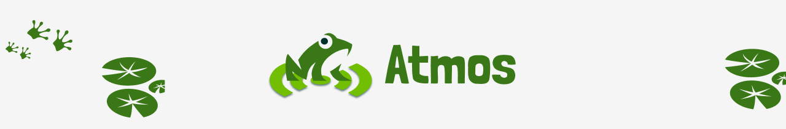
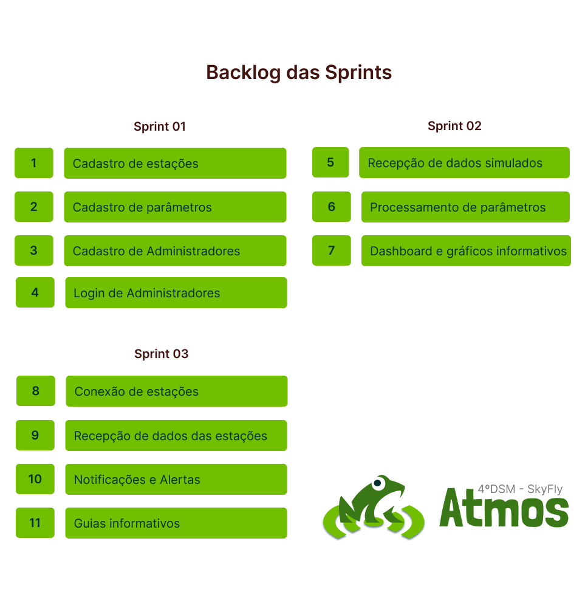

 

    <a href="#sobre"> Sobre o projeto</a> &nbsp |&nbsp &nbsp
    <a href="#entregas"> Entregas </a> &nbsp |&nbsp &nbsp
    <a href="#tecnologias"> Tecnologias utilizadas </a> &nbsp |&nbsp &nbsp  
    <a href="#backlog"> Backlog do produto </a> &nbsp |&nbsp &nbsp
    <a href="#autores"> Equipe </a> &nbsp |&nbsp &nbsp
    <a href="#links"> Links Úteis </a> 

# 📑 Sobre o projeto

O Atmos é um aplicação web moderna e responsiva com a capacidade de monitorar o clima e condições do solo a partir de estações meteorológicas distribuídas pela cidade de São José dos Campos. Tal funcionalidade permite com que a aplicação envie alertas em casos de condições de risco.

  

# 🏁 Entregas de Sprints

Cada entrega foi realizada a partir da criação de uma **tag** em cada repositório, além da criação de uma branch neste repositório com um relatório completo de tudo o que foi desenvolvido naquela sprint.
| Sprint | Previsão de entrega | Status | Histórico |
|:--:|:----------:|:-------------------|:-------------------------------------------------:|
| 01 | 08/09/2025 a 28/09/2025 | Em andamento | [Ver relatório]() |
| 02 | 06/10/2025 a 26/10/2025 | Em breve | [Ver relatório]() |
| 03 | 03/11/2025 a 23/11/2025 | Em breve |  [Ver relatório]()|

 

# 🛠️ Tecnologias Utilizadas

As seguintes ferramentas, linguagens, bibliotecas e tecnologias foram usadas na construção do projeto:

 

# 🎯 Backlog do Produto

 

## DoR (Definition of Ready) 

- **User Stories completas:** Todos os requisitos descritos em User Stories planejadas para caber na sprint.
- **Tarefas detalhadas e atribuídas:** Cada User Story deve ter ao menos uma task detalhada e atribuída a um responsável.
- **Critérios de aceitação definidos:** Cada User Story deve ter critérios de aceitação bem estabelecidos.
- **Estimativas definidas:** Todas as User Stories devem ter uma estimativa de esforço/tamanho feita pelo time
- **Wireframe/Mockup aprovados:** O cliente deve ter validado e aprovado os protótipos visuais.
- **Modelo de dados finalizado:** Estrutura de dados completamente definida e documentada.
- **Testes de aceitação definidos:** Incluindo testes sugeridos pelo cliente e testes de aceitação.
- **Ambiente de desenvolvimento pronto:** O time deve ter acesso a todos os ambientes, ferramentas e permissões necessárias.

 

## DoD (Definition of Done) 

- **Critérios de aceitação validados:** Todos os critérios de aceitação foram atendidos e verificados com testes apropriados.
- **Execução de testes adequados:** Testes unitários, de integração e de aceitação foram realizados para garantir a estabilidade e funcionamento correto da aplicação.
- **Código-fonte completo e padronizado:** O código está 100% implementado, refatorado e segue as boas práticas e padrões de qualidade definidos.
- **Commits organizados e documentados:** Os commits seguem a nomenclatura acordada, são claros, segmentados e possuem histórico bem documentado.
- **Guia de instalação detalhado:** A documentação de instalação é clara e completa, permitindo que qualquer usuário ou desenvolvedor configure e execute a aplicação sem dificuldades.
- **Manual do usuário disponível:** Um manual foi criado para orientar o cliente sobre o funcionamento da aplicação.

 

# 🔗 Links úteis
- [Modelo lógico do Banco de Dados](https://drive.google.com/file/d/12QT37gpqIwlUWXJmurE72GGgu8Mt4sjX/view?usp=sharing)
- [Fluxo de trabalho no Github](https://drive.google.com/file/d/18F6FAJzD4ICA4dIlYwwmbBYVurj4LQJG/view?usp=sharing)
- [Product backlog detalhado](https://docs.google.com/document/d/1vjvclXg3ROMe8RTefvWXqM33MQ0H1MwmVwH9GwyZX0k/edit?usp=sharing)
- [Wireframe da aplicação](https://www.figma.com/design/I2ve5ty4HGnBXGKYEpamqh/Atmos?node-id=0-1&p=f&t=etRZoSKjtiXJjEUf-0)
- [Arquitetura do projeto](https://drive.google.com/file/d/1Z2IJqIyfRZJQH9JDZv8rzPUhAL7kakLX/view?usp=sharing)
 

# 👥 Equipe

|    Função     | Nome                                  |                                                                                                                                                      LinkedIn & GitHub                                                                                                                                                      |
| :-----------: | :------------------------------------ | :-------------------------------------------------------------------------------------------------------------------------------------------------------------------------------------------------------------------------------------------------------------------------------------------------------------------------: |
|  Product Owner  | Sarah Montuani Batagioti               |       |
| Scrum Master  | André Salerno |            |
|  Team Member  | Brenno Rosa Lyrio de Oliveira               |       |
| Team Member   | Eric Lourenço Mendes da Silva      |                  |
|  Team Member  | Gustavo Muraoka Silva                 |                  |
|  Team Member  | Karen de Cássia Gonçalves     |               |
|  Team Member  | Guilherme dos Santos Benedito               |       |
|  Team Member  | Arthur Johannes Rodrigues Peres y Peres              |       |
